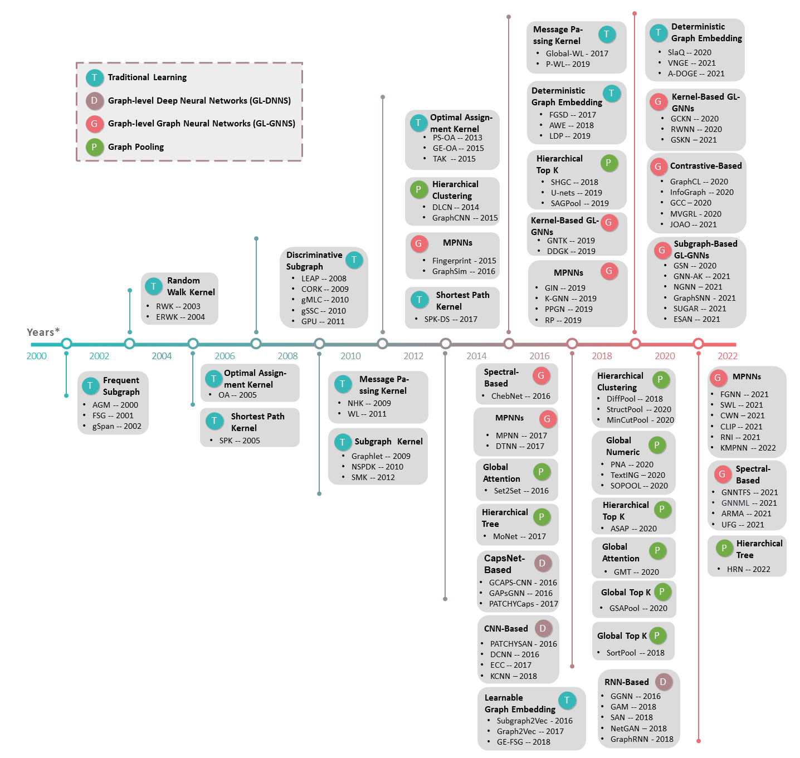

# Awesome Graph Level Learning
    

A collection of papers, implementations, datasets, and tools for graph-level learning.

- [Awesome Graph-level Learning](#a-timeline-of-graph-level-learning)
  - [Surveys](#surveys)
  - [Traditional Graph-level Learning](#traditional-graph-level-learning)
    - [Graph Kernels](#graph-kernels)
      - [Message Passing Kernels](#message-passing-kernels)
      - [Shortest Path Kernels](#shortest-path-kernels)
      - [Random Walk Kernels](#random-walk-kernels)
      - [Optimal Assignment Kernels](#optimal-assignment-kernels)
      - [Subgraph Kernels](#subgraph-kernels)
    - [Subgraph Mining](#subgraph-mining)
      - [Frequent Subgraph Mining](#frequent-subgraph-mining)
      - [Discriminative Subgraph Mining](#discriminative-subgraph-mining)
    - [Graph Embedding](#graph-embedding)
      - [Deterministic Graph Embedding](#deterministic-graph-embedding)
      - [Learnable Graph Embedding](#learnable-graph-embedding)
  - [Graph-Level Deep Neural Networks (GL-DNNs)](#graph-Level-deep-neural-networks)
    - [Recurrent Neural Network-based Graph-level Learning](#recurrent-neural-network-based-graph-level-learning)
    - [Convolution Neural Network-based Graph-level Learning](#convolution-neural-network-based-graph-level-learning)
    - [Capsule Neural Network-based Graph-level Learning](#capsule-neural-network-based-graph-level-learning)
  - [Graph-Level Graph Neural Networks (GL-GNNs)](#graph-Level-graph-neural-networks)
    - [Message Passing Neural Networks](#message-passing-neural-networks)
    - [Subgraph-based GL-GNNs](#Subgraph-based-gl-gnns)
    - [Kernel-based GL-GNNs](#kernel-based-gl-gnns)
    - [Contrastive-based GL-GNNs](#contrastive-based-gl-gnns)
    - [Spectral-based GL-GNNs](#spectral-based-gl-gnns)
  - [Graph Pooling](#graph-pooling)
    - [Global Graph Pooling](#global-graph-pooling)
      - [Numeric Operation Pooling](#numeric-operation-pooling)
      - [Attention-based Pooling](#attention-based-pooling)
      - [Convolution Neural Network-based Pooling](#convolution-neural-network-based-pooling) 
      - [Global Top-K Pooling](#global-top-k-pooling)
    - [Hierarchical Graph Pooling](#hierarchical-graph-pooling)
      - [Clustering-based Pooling](#clustering-based-pooling)
      - [Hierarchical Top-K Pooling](#hierarchical-top-K-pooling)
      - [Hierarchical Tree-based Pooling](#hierarchical-tree-based-pooling)
  - [Datasets](#datasets)
  - [Applications](#Applications)
  - [Tools](#tools)  

----------
## A Timeline of Graph-level Learning

----------
## Surveys
| Paper Title | Venue | Year | Materials | 
| ---- | :----: | :----: | :----: | 
| A Comprehensive Survey of Graph-level Learning | arXiv | 2023 | [[Paper]()]|
| Graph Pooling for Graph Neural Networks: Progress, Challenges, and Opportunities | arXiv | 2022 | [[Paper](https://arxiv.org/pdf/2204.07321.pdf)]|
| Graph-level Neural Networks: Current Progress and Future Directions | arXiv | 2022 | [[Paper](https://arxiv.org/pdf/2205.15555.pdf)]| 
| A Survey on Graph Kernels | Appl. Netw. Sci. | 2020 | [[Paper](https://appliednetsci.springeropen.com/articles/10.1007/s41109-019-0195-3?ref=https://githubhelp.com)] |
| Deep Learning on Graphs: A Survey | IEEE Trans. Knowl. Data Eng. | 2020 | [[Paper](https://ieeexplore.ieee.org/abstract/document/9039675)] |
| A Comprehensive Survey on Graph Neural Networks | IEEE Trans. Neural Netw. Learn. Syst. | 2020| [[Paper](https://ieeexplore.ieee.org/abstract/document/9046288)] |

----------
## Traditional Graph-level Learning
### Graph Kernels
#### Message Passing Kernels
| Paper Title | Venue | Year | Method | Materials | 
| ---- | :----: | :----: | :----: | :----: | 
| A Persistent Weisfeiler-lehman Procedure for Graph Classification | ICML | 2019 | P-WL | [[Paper](http://proceedings.mlr.press/v97/rieck19a/rieck19a.pdf)] [[Code](https://github.com/BorgwardtLab/P-WL)]|
| Glocalized Weisfeiler-lehman Graph Kernels: Global-local Feature Maps of Graphs | ICDM | 2017 | Global-WL | [[Paper](https://ieeexplore.ieee.org/abstract/document/8215505)] [[Code](https://github.com/chrsmrrs/glocalwl)]|
| Propagation kernels: Efficient Graph Kernels from Propagated Information | Mach. Learn. | 2016 | PK | [[Paper](https://link.springer.com/article/10.1007/s10994-015-5517-9)] [[Code](https://github.com/marionmari/propagation_kernels)]|
| Weisfeiler-lehman Graph Kernels | J. Mach. Learn. Res. | 2011 | WL | [[Paper](https://www.jmlr.org/papers/volume12/shervashidze11a/shervashidze11a.pdf)] [[Code](https://github.com/BorgwardtLab/graph-kernels)]|
| A linear-time graph kernel | ICDM | 2009 | NHK | [[Paper](https://ieeexplore.ieee.org/abstract/document/5360243)] [[Code](https://github.com/ysig/GraKeL)]|

#### Shortest Path Kernels 
| Paper Title | Venue | Year | Method | Materials | 
| ---- | :----: | :----: | :----: | :----: | 
| Shortest-path Graph Kernels for Document Similarity | EMNLP | 2017 | SPK-DS | [[Paper](https://aclanthology.org/D17-1202.pdf)]|
| Shortest-path Kernels on Graphs | ICDM | 2005 | SPK | [[Paper](https://ieeexplore.ieee.org/abstract/document/1565664)] [[Code](https://github.com/ysig/GraKeL)]|

#### Random Walk Kernels 
| Paper Title | Venue | Year | Method | Materials | 
| ---- | :----: | :----: | :----: | :----: | 
| Graph Kernels | J. Mach. Learn. Res. | 2010 | SOMRWK | [[Paper](https://www.jmlr.org/papers/volume11/vishwanathan10a/vishwanathan10a.pdf?ref=https://githubhelp.com)] [[Code](https://github.com/ysig/GraKeL)]|
| Extensions of Marginalized Graph Kernels | ICML | 2004 | ERWK | [[Paper](https://dl.acm.org/doi/abs/10.1145/1015330.1015446)] [[Code](https://github.com/jajupmochi/graphkit-learn)]|
| On Graph Kernels: Hardness Results and Efficient Alternatives | LNAI | 2003 | RWK | [[Paper](https://link.springer.com/chapter/10.1007/978-3-540-45167-9_11)] [[Code](https://github.com/jajupmochi/graphkit-learn)]|

#### Optimal Assignment Kernels
| Paper Title | Venue | Year | Method | Materials | 
| ---- | :----: | :----: | :----: | :----: | 
| Transitive Assignment Kernels for Structural Classification | SIMBAD | 2015 | TAK | [[Paper](https://link.springer.com/chapter/10.1007/978-3-319-24261-3_12)]|
| Learning With Similarity Functions on Graphs Using Matchings of Geometric Embeddings | KDD | 2015 | GE-OAK | [[Paper](https://dl.acm.org/doi/abs/10.1145/2783258.2783341)]|
| Solving the Multi-way Matching Problem by Permutation Synchronization | NeurIPS | 2013 | PS-OAK | [[Paper](https://proceedings.neurips.cc/paper/2013/file/3df1d4b96d8976ff5986393e8767f5b2-Paper.pdf)] [[Code](https://github.com/zju-3dv/multiway)]|
| Optimal Assignment Kernels for Attributed Molecular Graphs | ICML | 2005 | OAK | [[Paper](https://dl.acm.org/doi/abs/10.1145/1102351.1102380)]|

#### Subgraph Kernels
| Paper Title | Venue | Year | Method | Materials | 
| ---- | :----: | :----: | :----: | :----: | 
| Subgraph Matching Kernels for Attributed Graphs | ICML | 2012 | SMK | [[Paper](https://icml.cc/Conferences/2012/papers/542.pdf)] [[Code](https://github.com/fapaul/GraphKernelBenchmark)]|
| Fast Neighborhood Subgraph Pairwise Distance Kernel | ICML | 2010 | NSPDK | [[Paper](https://icml.cc/Conferences/2010/papers/347.pdf)] [[Code](https://github.com/fabriziocosta/EDeN)]|
| Efficient Graphlet Kernels for Large Graph Comparison | AISTATS | 2009 | Graphlet | [[Paper](http://proceedings.mlr.press/v5/shervashidze09a/shervashidze09a.pdf)] [[Code](https://github.com/ysig/GraKeL)]|

### Subgraph Mining
#### Frequent Subgraph Mining
| Paper Title | Venue | Year | Method | Materials | 
| ---- | :----: | :----: | :----: | :----: | 
| gspan: Graph-based Substructure Pattern Mining | ICDM | 2002 | gspan | [[Paper](https://ieeexplore.ieee.org/abstract/document/1184038)] [[Code](https://github.com/betterenvi/gSpan)]|
| Frequent Subgraph Discovery | ICDM | 2001 | FSG | [[Paper](https://ieeexplore.ieee.org/abstract/document/989534)] [[Code](https://github.com/NikhilGupta1997/Data-Mining-Algorithms)]|
| An Apriori-based Algorithmfor Mining Frequent Substructures from Graph Data | ECML-PKDD | 2000 | AGM | [[Paper](https://link.springer.com/chapter/10.1007/3-540-45372-5_2)] [[Code](https://github.com/Aditi-Singla/Data-Mining)]|

#### Discriminative Subgraph Mining
| Paper Title | Venue | Year | Method | Materials | 
| ---- | :----: | :----: | :----: | :----: | 
| Multi-graph-view Learning for Graph Classification | ICDM | 2014 | gCGVFL | [[Paper](https://ieeexplore.ieee.org/abstract/document/7023376)]|
| Positive and Unlabeled Learning for Graph Classification | ICDM | 2011 | gPU | [[Paper](https://ieeexplore.ieee.org/abstract/document/6137301)]|
| Semi-supervised Feature Selection for Graph Classification | KDD | 2010 | gSSC | [[Paper](https://dl.acm.org/doi/abs/10.1145/1835804.1835905)]|
| Multi-label Feature Selection for Graph Classification | ICDM | 2010 | gMLC | [[Paper](https://ieeexplore.ieee.org/abstract/document/5693981)]|
| Near-optimal Supervised Feature Selection Among Frequent Subgraphs | SDM | 2009 | CORK | [[Paper](https://epubs.siam.org/doi/epdf/10.1137/1.9781611972795.92)]|
| Mining Significant Graph Patterns by Leap Search | SIGMOD | 2008 | LEAP | [[Paper](https://dl.acm.org/doi/abs/10.1145/1376616.1376662)]|

### Graph Embedding
#### Deterministic Graph Embedding
| Paper Title | Venue | Year | Method | Materials | 
| ---- | :----: | :----: | :----: | :----: | 
| Fast Attributed Graph Embedding via Density of States | ICDM | 2021 | A-DOGE | [[Paper](https://ieeexplore.ieee.org/abstract/document/9679053)] [[Code](https://github.com/sawlani/A-DOGE)]|
| Bridging the Gap Between Von Neumann Graph Entropy and Structural Information: Theory and Applications | WWW | 2021 | VNGE | [[Paper](https://dl.acm.org/doi/abs/10.1145/3442381.3449804)] [[Code](https://github.com/xuecheng27/WWW21-Structural-Information)]|
| Just SLaQ When You Approximate: Accurate Spectral Distances for Web-Scale Graphs | WWW | 2021 | SLAQ | [[Paper](https://dl.acm.org/doi/abs/10.1145/3366423.3380026)] [[Code](https://github.com/google-research/google-research/tree/master/graph_embedding/slaq)]|
| A Simple Yet Effective Baseline for Non-attributed Graph Classification | ICLR-RLGM | 2019 | LDP | [[Paper](https://arxiv.org/pdf/1811.03508.pdf)] [[Code](https://github.com/Chen-Cai-OSU/LDP)]|
| Anonymous Walk Embeddings | ICML | 2018 | AWE | [[Paper](http://proceedings.mlr.press/v80/ivanov18a/ivanov18a.pdf)] [[Code](https://github.com/nd7141/AWE)]|
| Hunt For The Unique, Stable, Sparse And Fast Feature Learning On Graphs | NeurIPS | 2017 | FGSD | [[Paper](https://proceedings.neurips.cc/paper/2017/file/d2ddea18f00665ce8623e36bd4e3c7c5-Paper.pdf)] [[Code](https://github.com/vermaMachineLearning/FGSD)]|

#### Learnable Graph Embedding
| Paper Title | Venue | Year | Method | Materials | 
| ---- | :----: | :----: | :----: | :----: |
| Learning Graph Representation via Frequent Subgraphs | SDM | 2018 | GE-FSG | [[Paper](https://epubs.siam.org/doi/epdf/10.1137/1.9781611975321.35)] [[Code](https://github.com/nphdang/GE-FSG)]|
| graph2vec: Learning Distributed Representations of Graphs | KDD-MLG | 2017 | graph2vec | [[Paper](https://arxiv.org/pdf/1707.05005.pdf)] [[Code](https://github.com/MLDroid/graph2vec_tf)]|
| subgraph2vec: Learning Distributed Representations of Rooted Sub-graphs from Large Graphs | KDD-MLG | 2016 | subgraph2vec | [[Paper](https://arxiv.org/pdf/1606.08928.pdf)] [[Code](https://github.com/MLDroid/subgraph2vec_tf)]|

----------
## Graph-Level Deep Neural Networks
### Recurrent Neural Network-based Graph-level Learning
| Paper Title | Venue | Year | Method | Materials | 
| ---- | :----: | :----: | :----: | :----: | 
| GraphRNN: Generating Realistic Graphs with Deep Auto-regressive Models | ICML | 2018 | GraphRNN | [[Paper](http://proceedings.mlr.press/v80/you18a/you18a.pdf)] [[Code](https://github.com/snap-stanford/GraphRNN)]|
| NetGAN: Generating Graphs via Random Walks | ICML | 2018 | NetGAN | [[Paper](http://proceedings.mlr.press/v80/bojchevski18a/bojchevski18a.pdf)] [[Code](https://github.com/danielzuegner/netgan)]|
| Substructure Assembling Network for Graph Classification | AAAI | 2018 | SAN | [[Paper](https://ojs.aaai.org/index.php/AAAI/article/view/11742)]|
| Graph Classification using Structural Attention | KDD | 2018 | GAM | [[Paper](https://dl.acm.org/doi/pdf/10.1145/3219819.3219980)] [[Code](https://github.com/benedekrozemberczki/GAM)]|
| Gated Graph Sequence Neural Networks | ICLR | 2016 | GGNN | [[Paper](https://arxiv.org/pdf/1511.05493.pdf)] [[Code](https://github.com/Microsoft/gated-graph-neural-network-samples)]|

### Convolution Neural Network-based Graph-level Learning
| Paper Title | Venue | Year | Method | Materials | 
| ---- | :----: | :----: | :----: | :----: | 
| Kernel Graph Convolutional Neural Networks | ICANN | 2018 | KCNN | [[Paper](https://link.springer.com/chapter/10.1007/978-3-030-01418-6_3)] [[Code](https://github.com/giannisnik/cnn-graph-classification)]|
| Dynamic Edge-Conditioned Filters in Convolutional Neural Networks on Graphs | CVPR | 2017 | ECC | [[Paper](https://openaccess.thecvf.com/content_cvpr_2017/papers/Simonovsky_Dynamic_Edge-Conditioned_Filters_CVPR_2017_paper.pdf)] [[Code](https://github.com/mys007/ecc)]|
| Diffusion-Convolutional Neural Networks | NeurIPS | 2016 | DCNN | [[Paper](https://proceedings.neurips.cc/paper/2016/file/390e982518a50e280d8e2b535462ec1f-Paper.pdf)] [[Code](https://github.com/jcatw/dcnn)]|
| Learning Convolutional Neural Networks for Graphs | ICML | 2016 | PATCHYSAN | [[Paper](http://proceedings.mlr.press/v48/niepert16.pdf)] [[Code](https://github.com/tvayer/PSCN)]|

### Capsule Neural Network-based Graph-level Learning
| Paper Title | Venue | Year | Method | Materials | 
| ---- | :----: | :----: | :----: | :----: | 
| Capsule Neural Networks for Graph Classification using Explicit Tensorial Graph Representations | arXiv | 2019 | PATCHYCaps | [[Paper](https://arxiv.org/pdf/1902.08399.pdf)] [[Code](https://github.com/BraintreeLtd/PatchyCapsules)]|
| Capsule Graph Neural Network | ICLR | 2019 | CapsGNN | [[Paper](https://openreview.net/pdf?id=Byl8BnRcYm)] [[Code](https://github.com/benedekrozemberczki/CapsGNN)]|
| Graph Capsule Convolutional Neural Networks | WCB | 2018 | GCAPSCNN | [[Paper](https://arxiv.org/pdf/1805.08090.pdf)] [[Code](https://github.com/vermaMachineLearning/Graph-Capsule-CNN-Networks)]|

----------
## Graph-Level Graph Neural Networks
### Message Passing Neural Networks
| Paper Title | Venue | Year | Method | Materials | 
| ---- | :----: | :----: | :----: | :----: |  
| The Surprising Power of Graph Neural Networks with Random Node Initialization | IJCAI | 2021 | RNI | [[Paper](https://arxiv.org/pdf/2010.01179.pdf)]|
| Weisfeiler and Lehman Go Cellular: CW Networks | NeurIPS | 2021 | CWN | [[Paper](https://proceedings.neurips.cc/paper/2021/file/157792e4abb490f99dbd738483e0d2d4-Paper.pdf)] [[Code](https://github.com/twitter-research/cwn)]|
| Weisfeiler and Lehman Go Topological: Message Passing Simplicial Networks | ICML | 2021 | SWL | [[Paper](http://proceedings.mlr.press/v139/bodnar21a/bodnar21a.pdf)] [[Code](https://github.com/twitter-research/cwn)]|
| Expressive Power of Invariant and Equivariant Graph Neural Networks | ICLR | 2021 | FGNN | [[Paper](https://arxiv.org/pdf/2006.15646.pdf)] [[Code](https://github.com/mlelarge/graph_neural_net)]|
| Relational Pooling for Graph Representations | ICML | 2019 | RP | [[Paper](http://proceedings.mlr.press/v97/murphy19a/murphy19a.pdf)] [[Code](https://github.com/PurdueMINDS/RelationalPooling)]|
| Provably Powerful Graph Networks | NeurIPS | 2019 | PPGN | [[Paper](https://proceedings.neurips.cc/paper/2019/file/bb04af0f7ecaee4aae62035497da1387-Paper.pdf)] [[Code](https://github.com/hadarser/ProvablyPowerfulGraphNetworks)]|
| Weisfeiler and Leman Go Neural: Higher-Order Graph Neural Networks | AAAI | 2019 | K-GNN | [[Paper](https://ojs.aaai.org/index.php/AAAI/article/view/4384)] [[Code](https://github.com/chrsmrrs/k-gnn)]|
| How Powerful are Graph Neural Networks? | ICLR | 2019 | GIN | [[Paper](https://arxiv.org/pdf/1810.00826.pdf)] [[Code](https://github.com/weihua916/powerful-gnns)]|
| Quantum-chemical Insights from Deep Tensor Neural Networks | Nat. Commun. | 2017 | DTNN | [[Paper](https://www.nature.com/articles/ncomms13890)] [[Code](https://github.com/atomistic-machine-learning/dtnn)]|
| Neural Message Passing for Quantum Chemistry | ICML | 2017 | MPNN | [[Paper](http://proceedings.mlr.press/v70/gilmer17a/gilmer17a.pdf)] [[Code](https://github.com/priba/nmp_qc)]|
| Interaction Networks for Learning about Objects, Relations and Physics | NeurIPS | 2016 | GraphSim | [[Paper](https://proceedings.neurips.cc/paper/2016/file/3147da8ab4a0437c15ef51a5cc7f2dc4-Paper.pdf)] [[Code](https://github.com/clvrai/Relation-Network-Tensorflow)]|
| Convolutional Networks on Graphs for Learning Molecular Fingerprints | NeurIPS | 2015 | Fingerprint | [[Paper](https://proceedings.neurips.cc/paper/2015/file/f9be311e65d81a9ad8150a60844bb94c-Paper.pdf)] [[Code](https://github.com/HIPS/neural-fingerprint)]|

### Subgraph-based GL-GNNs
| Paper Title | Venue | Year | Method | Materials | 
| ---- | :----: | :----: | :----: | :----: |  
| Equivariant Subgraph Aggregation Networks | ICLR | 2021 | ESAN | [[Paper](https://arxiv.org/pdf/2110.02910.pdf)] [[Code](https://github.com/beabevi/esan)]|
| SUGAR: Subgraph Neural Network with Reinforcement Pooling and Self-Supervised Mutual Information Mechanism | WWW | 2021 | SUGAR | [[Paper](https://dl.acm.org/doi/abs/10.1145/3442381.3449822)] [[Code](https://github.com/RingBDStack/SUGAR)]|
| A New Perspective on "How Graph Neural Networks Go Beyond Weisfeiler-Lehman?" | ICLR | 2021 | GraphSNN | [[Paper](https://openreview.net/pdf?id=uxgg9o7bI_3)] [[Code](https://github.com/wokas36/GraphSNN)]|
| Nested Graph Neural Network | NeurIPS | 2021 | NGNN | [[Paper](https://proceedings.neurips.cc/paper/2021/file/8462a7c229aea03dde69da754c3bbcc4-Paper.pdf)] [[Code](https://github.com/muhanzhang/nestedgnn)]|
| From Stars to Subgraphs: Uplifting Any GNN with Local Structure Awareness | ICLR | 2021 | GNN-AK | [[Paper](https://arxiv.org/pdf/2110.03753.pdf)] [[Code](https://github.com/LingxiaoShawn/GNNAsKernel)]|
| Subgraph Neural Networks | NeurIPS | 2020 | SubGNN | [[Paper](https://proceedings.neurips.cc/paper/2020/file/5bca8566db79f3788be9efd96c9ed70d-Paper.pdf)] [[Code](https://github.com/mims-harvard/SubGNN)]|
| Improving Graph Neural Network Expressivity via Subgraph Isomorphism Counting | IEEE Trans. Pattern Anal. Mach. Intell. | 2020 | GSN | [[Paper](https://ieeexplore.ieee.org/abstract/document/9721082)] [[Code](https://github.com/gbouritsas/GSN)]|

### Kernel-based GL-GNNs
| Paper Title | Venue | Year | Method | Materials | 
| ---- | :----: | :----: | :----: | :----: |  
| Theoretically Improving Graph Neural Networks via Anonymous Walk Graph Kernels | WWW | 2021 | GSKN | [[Paper](https://dl.acm.org/doi/pdf/10.1145/3442381.3449951)] [[Code](https://github.com/YimiAChack/GSKN)]|
| Random Walk Graph Neural Networks | NeurIPS| 2020 | RWNN | [[Paper](https://proceedings.neurips.cc/paper/2020/file/ba95d78a7c942571185308775a97a3a0-Paper.pdf)] [[Code](https://github.com/giannisnik/rwgnn)]|
| Convolutional Kernel Networks for Graph-Structured Data | ICML | 2020 | GCKN | [[Paper](http://proceedings.mlr.press/v119/chen20h/chen20h.pdf)] [[Code](https://github.com/claying/GCKN)]|
| DDGK: Learning Graph Representations for Deep Divergence Graph Kernels | WWW | 2019 | DDGK | [[Paper](https://dl.acm.org/doi/abs/10.1145/3308558.3313668)] [[Code](https://github.com/google-research/google-research/tree/master/graph_embedding/ddgk)]|
| Graph Neural Tangent Kernel: Fusing Graph Neural Networks with Graph Kernels | NeurIPS | 2019 | GNTK | [[Paper](https://proceedings.neurips.cc/paper/2019/file/663fd3c5144fd10bd5ca6611a9a5b92d-Paper.pdf)] [[Code](https://github.com/KangchengHou/gntk)]|

### Contrastive-based GL-GNNs
| Paper Title | Venue | Year | Method | Materials | 
| ---- | :----: | :----: | :----: | :----: |  
| Graph Contrastive Learning Automated | ICML | 2021 | JOAO | [[Paper](http://proceedings.mlr.press/v139/you21a/you21a.pdf)] [[Code](https://github.com/Shen-Lab/GraphCL Automated)]|
| Contrastive Multi-View Representation Learning on Graphs | ICML | 2020 | MVGRL | [[Paper](http://proceedings.mlr.press/v119/hassani20a/hassani20a.pdf)] [[Code](https://github.com/kavehhassani/mvgrl)]|
| GCC: Graph Contrastive Coding for Graph Neural Network Pre-Training | KDD | 2020 | ESAN | [[Paper](https://dl.acm.org/doi/abs/10.1145/3394486.3403168)] [[Code](https://github.com/THUDM/GCC)]|
| InfoGraph: Unsupervised and Semi-supervised Graph-Level Representation Learning via Mutual Information Maximization | ICLR | 2020 | InfoGraph | [[Paper](https://openreview.net/pdf?id=r1lfF2NYvH)] [[Code](https://github.com/fanyun-sun/InfoGraph)]|
| Graph Contrastive Learning with Augmentations | NeurIPS | 2020 | GraphCL | [[Paper](https://proceedings.neurips.cc/paper/2020/file/3fe230348e9a12c13120749e3f9fa4cd-Paper.pdf)] [[Code](https://github.com/Shen-Lab/GraphCL)]|

### Spectral-based GL-GNNs
| Paper Title | Venue | Year | Method | Materials | 
| ---- | :----: | :----: | :----: | :----: |  
| How Framelets Enhance Graph Neural Networks | ICML | 2021 | UFG | [[Paper](http://proceedings.mlr.press/v139/zheng21c/zheng21c.pdf)] [[Code](https://github.com/YuGuangWang/UFG)]|
| Graph Neural Networks With Convolutional ARMA Filters | IEEE Trans. Pattern Anal.
Mach. Intell. | 2021 | ARMA | [[Paper](https://ieeexplore.ieee.org/abstract/document/9336270)] [[Code](https://github.com/dmlc/dgl/tree/master/examples/pytorch/arma)]|
| Breaking the Limits of Message Passing Graph Neural Networks | ICML | 2021 | GNNMatlang | [[Paper](http://proceedings.mlr.press/v139/balcilar21a/balcilar21a.pdf)] [[Code](https://github.com/balcilar/gnn-matlang)]|
| Transferability of Spectral Graph Convolutional Neural Networks | J. Mach. Learn. Res. | 2021 | GNNTFS | [[Paper](https://www.jmlr.org/papers/volume22/20-213/20-213.pdf)]|
| Convolutional Neural Networks on Graphs with Fast Localized Spectral Filtering | NeurIPS | 2016 | ChebNet | [[Paper](https://proceedings.neurips.cc/paper/2016/file/04df4d434d481c5bb723be1b6df1ee65-Paper.pdf)] [[Code](https://github.com/mdeff/cnn graph)]|

----------
## Graph Pooling
### Global Graph Pooling
#### Numeric Operation Pooling
| Paper Title | Venue | Year | Method | Materials | 
| ---- | :----: | :----: | :----: | :----: | 
| Second-Order Pooling for Graph Neural Networks | IEEE Trans. Pattern Anal. Mach. Intell | 2020 | SOPOOL | [[Paper](https://ieeexplore.ieee.org/abstract/document/9104936)] [[Code](https://github.com/divelab/sopool)]|
| Every Document Owns Its Structure: Inductive Text Classification via Graph Neural Networks | ACL | 2020 | TextING | [[Paper](https://aclanthology.org/2020.acl-main.31.pdf)] [[Code](https://github.com/CRIPAC-DIG/TextING)]|
| Principal Neighbourhood Aggregation for Graph Nets | NeurIPS | 2020 | PNA | [[Paper](https://proceedings.neurips.cc/paper/2020/file/99cad265a1768cc2dd013f0e740300ae-Paper.pdf)] [[Code](https://github.com/lukecavabarrett/pna)]|

#### Attention-based Pooling
| Paper Title | Venue | Year | Method | Materials | 
| ---- | :----: | :----: | :----: | :----: | 
| Order Matters: Sequence to Sequence for Sets | ICLR | 2021 | Set2Set | [[Paper](https://static.googleusercontent.com/media/research.google.com/zh-CN//pubs/archive/44871.pdf)] [[Code](https://github.com/pyg-team/pytorch_geometric)]|

#### Convolution Neural Network-based Pooling
| Paper Title | Venue | Year | Method | Materials | 
| ---- | :----: | :----: | :----: | :----: | 
| Kernel Graph Convolutional Neural Networks | ICANN | 2018 | KCNN | [[Paper](https://link.springer.com/chapter/10.1007/978-3-030-01418-6_3)] [[Code](https://github.com/giannisnik/cnn-graph-classification)]|
| Learning Convolutional Neural Networks for Graphs | ICML | 2016 | PATCHYSAN | [[Paper](http://proceedings.mlr.press/v48/niepert16.pdf)] [[Code](https://github.com/tvayer/PSCN)]|

#### Global Top-K Pooling
| Paper Title | Venue | Year | Method | Materials | 
| ---- | :----: | :----: | :----: | :----: | 
| Structure-Feature based Graph Self-adaptive Pooling | WWW | 2020 | GSAPool | [[Paper](https://dl.acm.org/doi/abs/10.1145/3366423.3380083)] [[Code](https://github.com/psp3dcg/gsapool)]|
| An End-to-End Deep Learning Architecture for Graph Classification | AAAI | 2018 | SortPool | [[Paper](https://ojs.aaai.org/index.php/AAAI/article/view/11782)] [[Code](https://github.com/muhanzhang/pytorch DGCNN)]|

### Hierarchical Graph Pooling
#### Clustering-based Pooling
| Paper Title | Venue | Year | Method | Materials | 
| ---- | :----: | :----: | :----: | :----: | 
| Accurate Learning of Graph Representations with Graph Multiset Pooling | ICLR | 2020 | GMT | [[Paper](https://openreview.net/pdf?id=JHcqXGaqiGn)] [[Code](https://github.com/JinheonBaek/GMT)]|
| Spectral Clustering with Graph Neural Networks for Graph Pooling | ICML | 2020 | MinCutPool | [[Paper](http://proceedings.mlr.press/v119/bianchi20a/bianchi20a.pdf)] [[Code](https://github.com/FilippoMB/Spectral-Clustering-with-Graph-Neural-Networks-for-Graph-Pooling)]|
| StructPool: Structured Graph Pooling via Conditional Random Fields | ICLR  | 2020 | StructPool | [[Paper](https://openreview.net/pdf?id=BJxg_hVtwH)] [[Code](https://github.com/Nate1874/StructPool)]|
| Graph Convolutional Networks with EigenPooling | KDD | 2019 | EigenPool | [[Paper](https://dl.acm.org/doi/abs/10.1145/3292500.3330982)] [[Code](https://github.com/alge24/eigenpooling)]|
| Hierarchical Graph Representation Learning with Differentiable Pooling | NeurIPS | 2018 | DiffPool | [[Paper](https://proceedings.neurips.cc/paper/2018/file/e77dbaf6759253c7c6d0efc5690369c7-Paper.pdf)] [[Code](https://github.com/RexYing/diffpool)]|
| Deep Convolutional Networks on Graph-Structured Data | arXiv | 2015 | GraphCNN | [[Paper](https://arxiv.org/pdf/1506.05163.pdf)] [[Code](https://github.com/mdeff/cnn graph)]|
| Spectral Networks and Locally Connected Networks on Graphs | ICLR | 2014 | DLCN | [[Paper](https://arxiv.org/pdf/1312.6203.pdf)] |

#### Hierarchical Top-K Pooling
| Paper Title | Venue | Year | Method | Materials | 
| ---- | :----: | :----: | :----: | :----: | 
| ASAP: Adaptive Structure Aware Pooling for Learning Hierarchical Graph Representations | AAAI | 2020 | ASAP | [[Paper](https://ojs.aaai.org/index.php/AAAI/article/view/5997)] [[Code](https://github.com/malllabiisc/ASAP)]|
| Self-Attention Graph Pooling | ICML | 2019 | SAGPool | [[Paper](http://proceedings.mlr.press/v97/lee19c/lee19c.pdf)] [[Code](https://github.com/inyeoplee77/SAGPoo)]|
| Graph U-Nets | ICML | 2019 | U-Nets | [[Paper](http://proceedings.mlr.press/v97/gao19a/gao19a.pdf)] [[Code](https://github.com/HongyangGao/Graph-U-Nets)]|
| Towards Sparse Hierarchical Graph Classifiers | arXiv | 2018 | SHGC | [[Paper](https://arxiv.org/pdf/1811.01287.pdf)] [[Code](https://github.com/HeapHop30/hierarchical-pooling)]|

#### Hierarchical Tree-based Pooling
| Paper Title | Venue | Year | Method | Materials | 
| ---- | :----: | :----: | :----: | :----: | 
| A Simple yet Effective Method for Graph Classification | IJCAI | 2022 | HRN | [[Paper](https://arxiv.org/pdf/2206.02404.pdf)] [[Code](https://github.com/Wu-Junran/HierarchicalReporting)]|
| Edge Contraction Pooling for Graph Neural Networks | arXiv | 2019 | EdgePool | [[Paper](https://arxiv.org/pdf/1905.10990.pdf)] [[Code](https://github.com/pyg-team/pytorch_geometric/blob/master/torch_geometric/nn/pool/edge_pool.py)]|
| Geometric Deep Learning on Graphs and Manifolds Using Mixture Model CNNs | CVPR | 2017 | MoNet | [[Paper](https://openaccess.thecvf.com/content_cvpr_2017/papers/Monti_Geometric_Deep_Learning_CVPR_2017_paper.pdf)] [[Code](https://github.com/dmlc/dgl/tree/master/examples/mxnet/monet)]|

----------
## Datasets
### Citation/Co-authorship Networks
- Citeseer, Cora, Pubmed https://linqs.soe.ucsc.edu/data
- DBLP http://snap.stanford.edu/data/com-DBLP.html
- Chemistry, Computer Science, Medicine, Engineering http://kddcup2016.azurewebsites.net/
### Online Social Networks
- Facebook http://snap.stanford.edu/data/ego-Facebook.html
- Epinions http://www.epinions.com/
- Youtube http://snap.stanford.edu/data/com-Youtube.html
- Last.fm https://www.last.fm/
- LiveJournal http://snap.stanford.edu/data/soc-LiveJournal1.html
- Gplus http://snap.stanford.edu/data/ego-Gplus.html
### Traditional Social Networks
- Cellphone Calls http://www.cs.umd.edu/hcil/VASTchallenge08/
- Enron Mail http://www.cs.cmu.edu/~enron/
- Friendship https://dl.acm.org/doi/10.1145/2501654.2501657
- Rados http://networkrepository.com/ia-radoslaw-email.php 
- Karate, Football, Dolphin http://www-personal.umich.edu/~mejn/netdata/
### Webpage Networks
- IMDb https://www.imdb.com/
- Wiki https://linqs.soe.ucsc.edu/data
### Product Co-purchasing Networks
- Amazon http://snap.stanford.edu/data/#amazon
### Other Networks
- Internet http://www-personal.umich.edu/~mejn/netdata/
- Java https://github.com/gephi/gephi/wiki/Datasets
- Hypertext http://www.sociopatterns.org/datasets
 
 ----------
## Tools
- Gephi https://gephi.org/
- Pajek http://mrvar.fdv.uni-lj.si/pajek/
- LFR https://www.santofortunato.net/resources

----------
**Disclaimer**

If you have any questions, please feel free to contact us.
Emails: <u>fanzhen.liu@hdr.mq.edu.au</u>, <u>xing.su2@hdr.mq.edu.au</u>
